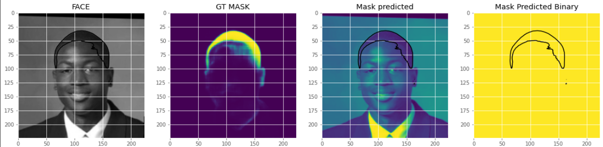

# Hair segmentation with Unet


This repository contains the implementation of a deep learning algorithm for hair segmentation:
- CNN is used to segment hair in face images. This is a binary classification task: the neural network predicts if each pixel in the image is either hair or non-hair. This neural network structure is derived from the U-Net architecture, described in this [paper](https://arxiv.org/abs/1505.04597). The performance of this segmentation network is tested on the [LFW | Part Labels Database](http://vis-www.cs.umass.edu/lfw/part_labels/) and achieve an accuracy of 92%, that is the best score from papers we have read so far.

The folder ./weights contains the pre-trained weights for segmentation.
The folder ./libs contains the functions used by main files.

# Install requirements:
- It's recommanded to install dependencies inside a virtual environnement like venv.
- If you have a GPU comment and uncomment requirement.txt to download the right version of tensorflow.
```
$ pip install -r requirement.txt
```

# Segmentation

- Then run the file create_dataset.py to create and process the training data.
- Run train.segmentation.py to train the network for segmentation, model will be save inside ./weights .
- Run test_segmentation.py to test the segmentation on test images. The test images should be 224x224x3, you need to put test images inside datasets/test/ after creating it.

